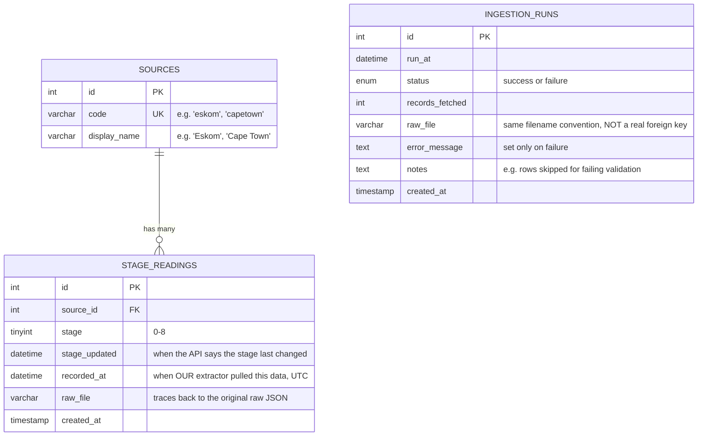

# Database Schema Design

This documents the MySQL schema defined in [`db/schema.sql`](../db/schema.sql).
For the reasoning behind specific design choices, see
[decisions.md](decisions.md) (Week 3 and later entries).

## Entity-Relationship Diagram

Note: `INGESTION_RUNS` is drawn separately with no formal relationship
line to the other two tables. It references `raw_file` by the same
filename convention `STAGE_READINGS` uses, but this is NOT a real
foreign key - see "A deliberate limitation" below.

## The three tables, and why each one exists

### `sources` - a lookup table

Stores each data source once: its short code (`eskom`, `capetown`) and
its human-readable name (`Eskom`, `Cape Town`).

**Why it's separate from `stage_readings`:** a source's display name
doesn't change per reading - it only depends on the source code.
Storing it once here and referencing it by foreign key avoids
repeating the same string on every row, and guarantees it's spelled
consistently everywhere. This is standard second/third normal form
reasoning: a non-key attribute should depend on the key, the whole
key, and nothing but the key.

**Grows automatically:** the loader creates a new row here
automatically if the API ever reports a source not seen before -
no manual schema update required.

### `stage_readings` - the actual time-series data

One row per source, per extraction run. This is the table that grows
every time the pipeline runs.

Two separate timestamp columns exist because they mean genuinely
different things:
- `stage_updated` - when the API itself says the stage last changed
- `recorded_at` - when THIS pipeline happened to check

Conflating these would lose information - polling the API ten times in
a row and getting the same `stage_updated` back each time is itself a
meaningful fact (the stage has been stable), not a duplicate.

`raw_file` gives every row **data lineage**: if a value ever looks
wrong, it can be traced straight back to the original, untouched raw
JSON file it came from, rather than just trusting the transformed
value.

An index on `(source_id, recorded_at)` speeds up the most common
query shape this schema needs to serve: "give me the latest reading(s)
for source X" - exactly what the REST API's `/api/readings/latest`
and `/api/readings/source/{code}` endpoints do.

### `ingestion_runs` - the pipeline's own audit log

Not load shedding data at all - data *about the pipeline's own
behaviour*. Every extract/transform/load attempt writes one row here,
whether it succeeded or failed.

This is what makes "did the pipeline actually run last night, and did
it work?" answerable by a query instead of having to dig through logs
that may no longer exist. The `notes` column exists separately from
`error_message` on purpose: `error_message` means the run itself
broke; `notes` means the run succeeded but something about the *data*
was still worth flagging (e.g. some rows failed validation and were
skipped). Conflating those two would make it harder to tell, at a
glance, whether the pipeline needs debugging or the upstream data
source does.

## A deliberate limitation, worth being able to explain

`ingestion_runs.raw_file` is a plain string, not a real foreign key
into anything. It exists purely for a human (or a query) to correlate
"this run" with "this file" by matching filenames - there's no
database-level constraint enforcing that connection.

**Why this is acceptable at this project's scale:** adding a proper
`raw_extracts` table (one row per raw file, with `stage_readings` and
`ingestion_runs` both formally referencing it via foreign key) would
be the "more correct" normalised design. At this data volume, the
practical benefit is small, and the added complexity - another table,
another join for every query - wasn't worth it yet.

**What this is a real answer to, if asked "what would you improve":**
introduce a `raw_extracts` table as the single source of truth for
"a file was extracted," and have both `stage_readings` and
`ingestion_runs` reference it by foreign key instead of by filename
string. That would make the relationship enforceable by the database
itself, not just conventionally true.
